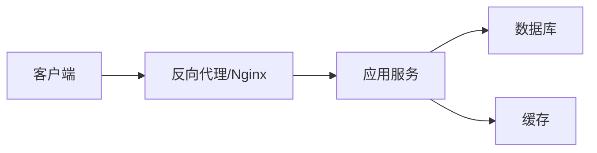

# 部署文档

> 如果某个章节不适用于当前项目（如无数据库迁移），直接删除该章节，而非留空表格。

## 环境要求

| 依赖 | 版本要求 | 说明 |
|------|----------|------|
| 运行时 | — | 如 Node.js 18+, Java 17+, Python 3.10+ |
| 数据库 | — | 如 MySQL 8.0, PostgreSQL 15 |
| 中间件 | — | 如 Redis 7, RabbitMQ |
| 其他 | — | 如 Nginx, Docker |

## 部署架构

> 描述系统的部署拓扑：几个服务、如何部署、网络关系。



## 环境变量 / 配置

| 配置项 | 环境变量 | 默认值 | 说明 |
|--------|----------|--------|------|
| 端口 | PORT | 3000 | 服务监听端口 |
| 数据库地址 | DB_HOST | localhost | 数据库连接地址 |
| 密钥 | SECRET_KEY | — | 必须，不要提交到代码库 |

> 列出所有需要配置的环境变量，标注哪些是必须的。

## 部署步骤

### 本地开发环境

```bash
# 1. 克隆仓库
git clone <repo-url>

# 2. 安装依赖
...

# 3. 配置环境变量
cp .env.example .env

# 4. 启动服务
...
```

### 生产环境

> 描述生产环境的部署流程（CI/CD、容器化、手动部署等）。

## 数据库迁移

> 如果项目有数据库迁移，描述如何执行。

```bash
# 运行迁移
...

# 回滚
...
```

## 健康检查

> 如何验证部署是否成功。

| 检查项 | 方式 |
|--------|------|
| 服务存活 | `GET /health` |
| 数据库连接 | 检查日志输出 |
| 依赖服务 | — |

## 常见问题

| 问题 | 原因 | 解决方案 |
|------|------|----------|
| —    | —    | —        |
