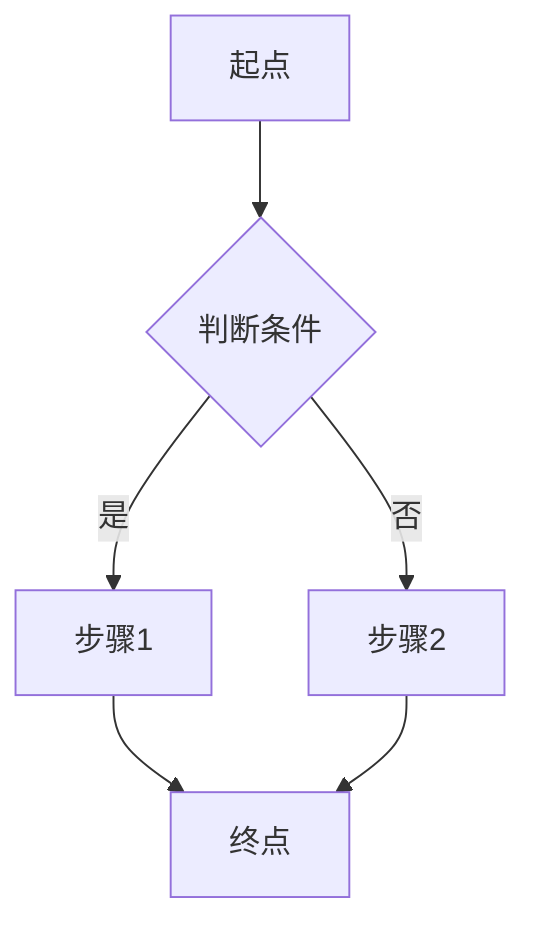

# {{流程名}}

> 如果某个章节不适用于当前流程（如无性能考量），直接删除该章节，而非留空。

## 概述

> 用 1-2 句话描述这个业务流程的目的：从哪里开始，到哪里结束，达成什么业务目标。

## 流程图

> 用 Mermaid 图描述流程的关键步骤和分支。

## 步骤详解

### 1. 步骤名称

- **触发条件**：什么触发了这一步
- **处理逻辑**：这一步做了什么
- **涉及的功能**：[[feature-a]]、[[feature-b]]
- **输出/状态变化**：这一步产生了什么变化

### 2. 步骤名称

> 同上格式，逐步展开。

## 涉及的模块

| 模块 | 角色 |
|------|------|
| [[模块A]] | 提供哪些能力参与此流程 |
| [[模块B]] | 提供哪些能力参与此流程 |

## 涉及的功能（Features）

| Feature | 在流程中的角色 |
|---------|----------------|
| [[feature-a]] | 负责什么处理 |
| [[feature-b]] | 负责什么处理 |

> 列出此流程中实际执行工作的 feature 页面。Flow 本身不描述实现细节，实现细节在对应的 feature 页面中。

## 错误处理

> 描述流程中可能出现的错误、异常分支和恢复策略。

| 错误场景 | 处理方式 |
|----------|----------|
| —        | —        |

## 性能考量

> 如果流程有性能相关的注意点（瓶颈、缓存策略、并发处理等），在此说明。
