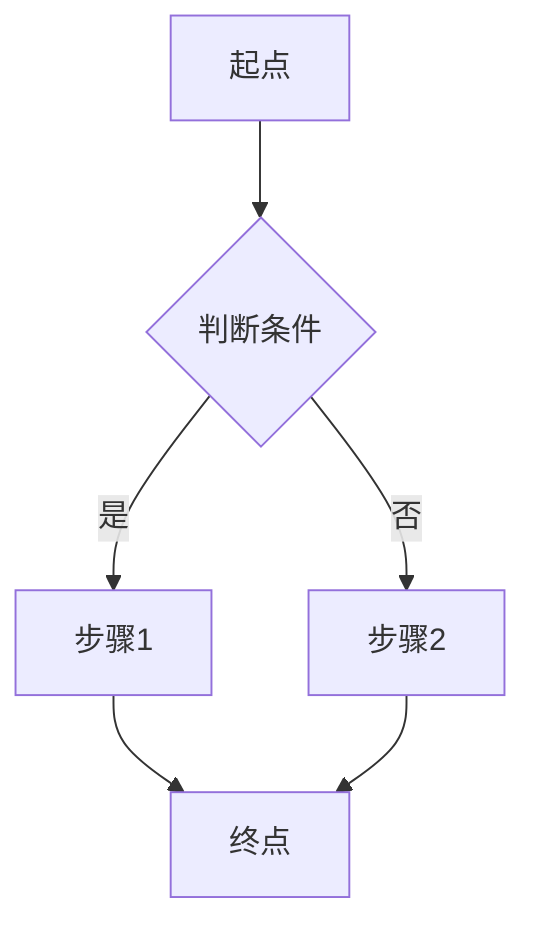

# {{流程名}}

> 核心章节（概述、步骤详解、涉及的模块、涉及的功能）必须包含。
> 扩展章节仅在源码有明确证据时添加，无证据不要创建。

## 概述

> 用 1-2 句话描述这个协作流程的目的：从哪里开始，到哪里结束，达成什么业务目标。

## 步骤详解

### 1. 步骤名称

- **触发条件**：什么触发了这一步
- **处理逻辑**：这一步做了什么
- **涉及的功能**：[[features/feature-a]]、[[features/feature-b]]
- **输出/状态变化**：这一步产生了什么变化

### 2. 步骤名称

> 同上格式，逐步展开。

## 涉及的模块

| 模块 | 角色 |
|------|------|
| [[modules/模块A]] | 提供哪些能力参与此流程 |
| [[modules/模块B]] | 提供哪些能力参与此流程 |

## 涉及的功能（Features）

| Feature | 在流程中的角色 |
|---------|----------------|
| [[features/feature-a]] | 负责什么处理 |
| [[features/feature-b]] | 负责什么处理 |

> 列出此流程中实际执行工作的 feature 页面。Flow 本身不描述实现细节，实现细节在对应的 feature 页面中。

## 流程图

> 【扩展章节】流程结构清晰且有多条分支路径时添加，线性流程不需要此章节。

```mermaid
flowchart TD
    A[起点] --> B{判断条件}
    B -->|是| C[步骤1]
    B -->|否| D[步骤2]
    C --> E[终点]
    D --> E
```

## 错误处理

> 【扩展章节】流程中有非平凡的错误/异常分支和恢复策略时添加，无特殊错误处理时不要创建此章节。

| 错误场景 | 处理方式 |
|----------|----------|
| —        | — |

## 性能考量

> 【扩展章节】流程有性能相关的注意点（瓶颈、缓存策略、并发处理等）时添加，无性能考量时不要创建此章节。
